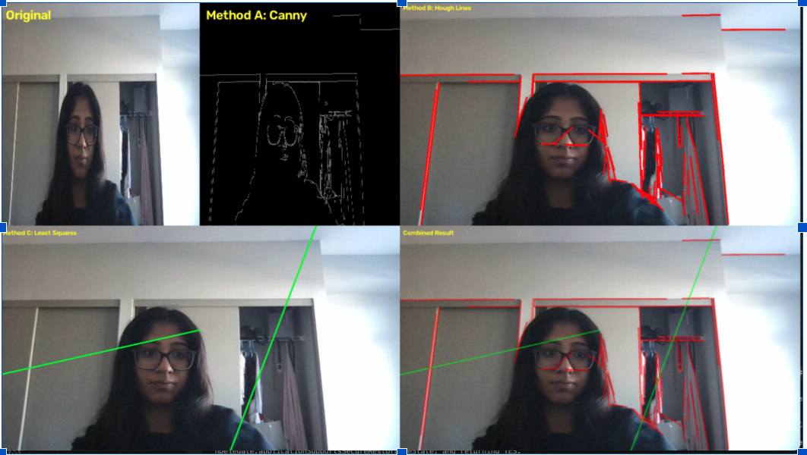
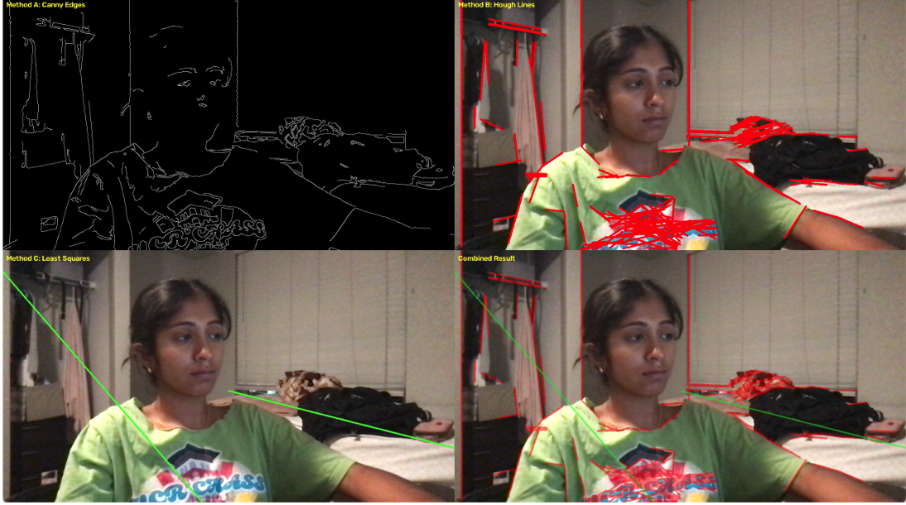

# Real-Time Edge and Line Detection

A real-time computer vision program built with Python and OpenCV. The program captures video from a webcam and compares three different methods for detecting edges and line structures.

## Features

- Captures live video from a webcam
- Applies Canny edge detection
- Detects line segments using the probabilistic Hough transform
- Fits lines using least-squares line fitting
- Displays the results in real time
- Compares the methods under different visual conditions

## Detection Methods

### Canny Edge Detection

Canny detects areas where the brightness changes sharply. The detected edges are displayed as white pixels on a black background.

### Hough Transform

The Hough transform uses the Canny edge map to detect straight line segments. The detected line segments are drawn in red on the original camera frame.

### Least-Squares Line Fitting

The program divides the image into left and right regions and fits a representative line to the detected edge pixels in each region. The fitted lines are displayed in green.

## Real-Time Display

The program displays four panels:

1. Original camera frame and Canny edge map
2. Hough line detections
3. Least-squares line fitting
4. Combined Hough and least-squares results

## Installation

Install the required Python packages:

```bash
pip install opencv-python numpy
```

## How to Run

Run the program from the terminal:

```bash
python bharath_shreya_line_detection.py
```

Press `q` or `Esc` to exit the program.

## Parameters

### Canny

```python
lower_threshold = 50
upper_threshold = 150
```

### Hough Transform

```python
threshold = 50
minLineLength = 50
maxLineGap = 20
```

Lower Canny thresholds detect more edges but may also introduce noise. Higher thresholds produce cleaner results but may miss weaker edges. The Hough parameters control how many line segments are detected and how gaps between edge pixels are handled.

## Example Results

### Experiment 1: Straight Edge

This experiment used a journal to create a dominant straight edge. Canny detected the journal’s outline, while the Hough transform detected several strong line segments. The least-squares method produced a general fitted line but was also influenced by other edges in the scene.



### Experiment 5: Challenging Scene

This experiment included partial occlusion and a noisy background. The occlusion interrupted some true edges, while the background created additional irrelevant edges. These conditions made the Hough and least-squares results less reliable.



## Observations

The Hough transform performed best when several clear line segments were present because it could detect each segment independently. Canny was useful for viewing basic edge structure but was sensitive to lighting, noise, and threshold values. Least-squares fitting was simple and fast, but its results were affected by outliers and multiple unrelated edges within the same region.

## Limitations

The least-squares method fits one representative line per image region, so it may not accurately represent scenes containing several different lines. The Hough transform may also produce false or duplicate detections when texture, noise, or thick edges are present.

## Technologies

- Python
- OpenCV
- NumPy
- Computer Vision
- Canny Edge Detection
- Hough Transform
- Least-Squares Line Fitting
